# MiSTer Control

A second screen and controller for the [MiSTer FPGA](https://mister-devel.github.io/MkDocs_MiSTer/).
One program runs on the MiSTer and serves a web app to any phone, tablet or computer on your
network. It shows the TV picture live on the phone, gives you a touch gamepad, launches games from
your library with box art, and manages saves, cheats, screenshots and manuals. Nothing is
installed on a PC. There is no account and no cloud service.

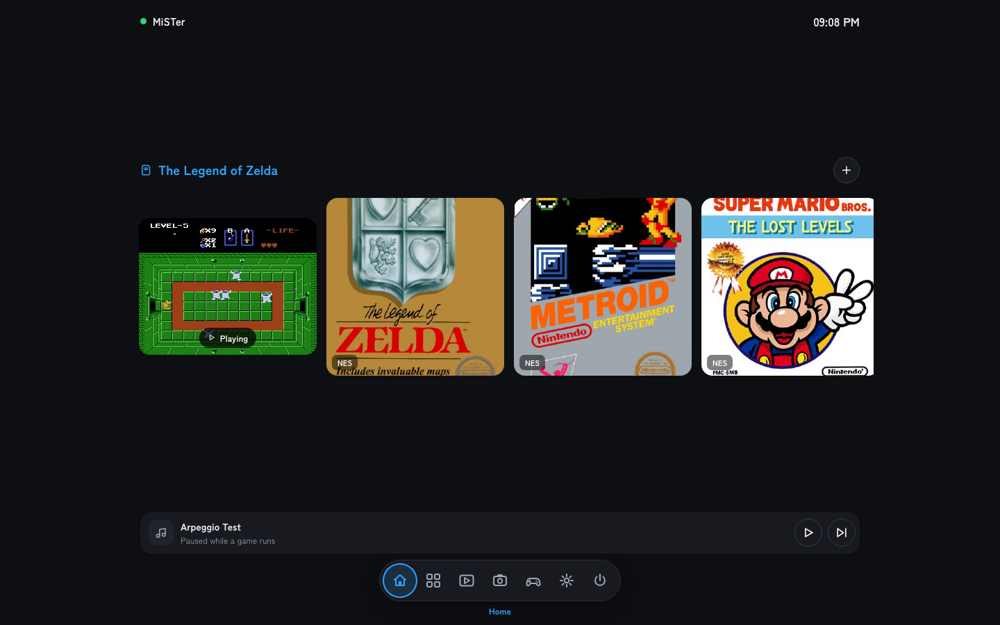

This repository holds the downloads and the installer. The application source is not published.

## Install

1. Download **`mister-control.sh`** from this repository (the file is listed above) and put it in
   `/media/fat/Scripts/` on your MiSTer. Use Samba, FTP, or take the SD card to a computer.
2. On the TV, open the MiSTer menu, go to **Scripts**, and run **`mister-control`**.
   Over SSH instead: `sh /media/fat/Scripts/mister-control.sh`
3. The script installs the app, starts it, and prints the address to open.

The installer downloads the current release, checks it, installs to `/media/fat/mister-control/`,
starts the app now and at every boot (through `/media/fat/linux/user-startup.sh`), and sets two
keys in `MiSTer.ini` (backup saved as `MiSTer.ini.mister-control.bak`): `log_file_entry=1` so the
MiSTer writes the running game's path to `/tmp` (this is how the app knows what is playing), and
`debug=2` so the MiSTer writes its messages to `/tmp/debug.txt` (this is how the app confirms a
cheat really went on). Both apply at the next core load.

The first install also downloads the offline game catalogue (about 150 MB, box art and metadata)
and a static ffmpeg for live broadcasting (about 32 MB). Both are kept across updates.

## Open the web interface

The app listens on port **8110**. Open `http://<your-MiSTer-IP>:8110` in any browser on the same
network, for example `http://192.168.1.50:8110`.

- The install script and the MiSTer's own OSD both show the address.
- In the app, **Settings > Network and access** shows the address and a QR code on the TV. Point
  the phone camera at it to open the app.
- Add it to the phone home screen ("Add to Home Screen") to run it full screen.

If other people share your network, set an access token (`-token`, or `MC_TOKEN` in `run.sh`). The
app then pairs a phone with a 6-digit PIN and remembers it.

## Features

### Home and the live picture

The Home screen shows what is playing now, with the live TV picture inside the tile, and your
recent games beside it. Tap a game to launch it. On an MC core (see below), the tile also shows the
game state, such as the world, lives and score.

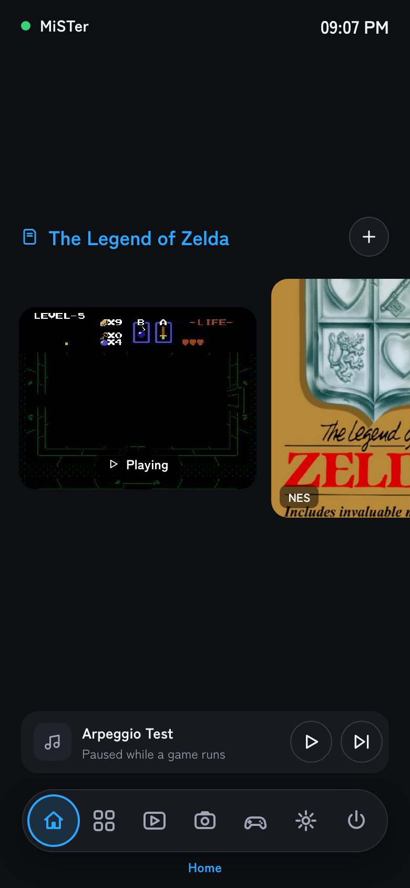

### Play on the phone

Tap the running game to open the touch gamepad. The TV picture streams above a full control pad,
with Capture and Clip buttons on the picture.

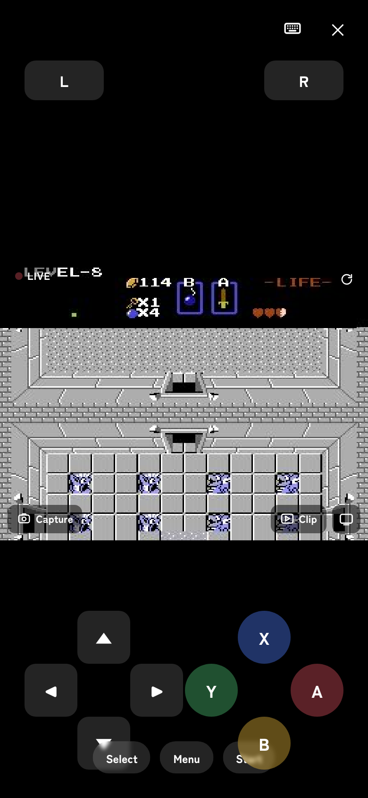

### Library

Every system on the card with box art, year, publisher and genre. Search, filter by letter,
region, genre, decade or players, mark favorites, and build collections. Art comes from an offline
catalogue that ships with the app; scrape ScreenScraper with your own account for the rest.

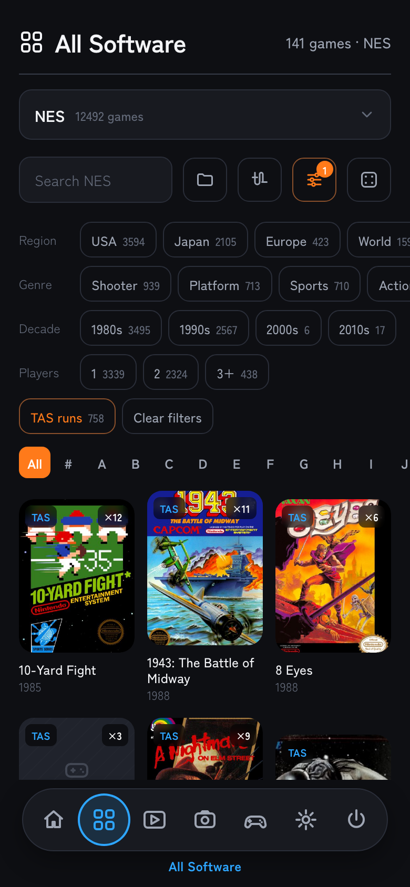

### Game sheet

Long press any game for its sheet: launch or restart, favorite, add to a collection, put a
shortcut in the TV menu, edit the entry, and follow links to GameFAQs, StrategyWiki, Wikipedia and
a longplay video. For a running game it also shows suspend points (the core's save state slots,
saved and loaded from the phone), cheats, core options, and play activity.

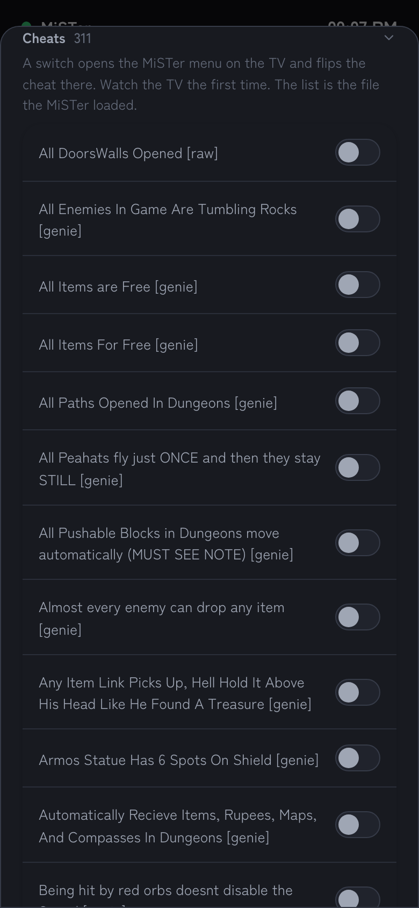 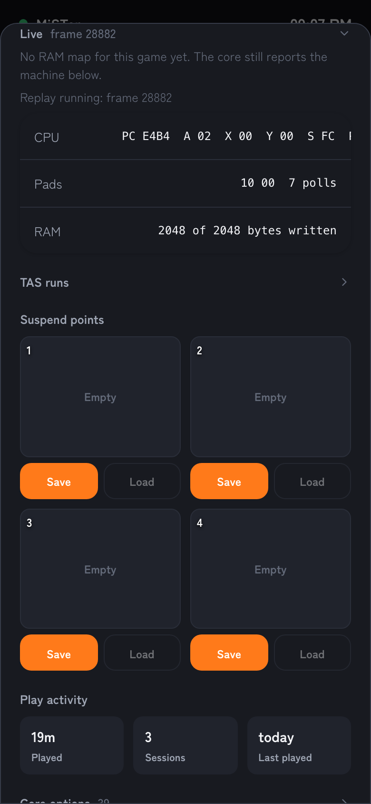

### MC-NES: MiSTer Control's own NES core

From Settings > Install you can add MC-NES, MiSTer Control's own build of the NES core, installed
next to the stock one and sharing the same games, saves and cheats. It reports the game's memory,
CPU registers and controller state to the app once per frame, so the game sheet gains a Live fold
with the decoded values and the Home tile shows them under the picture.

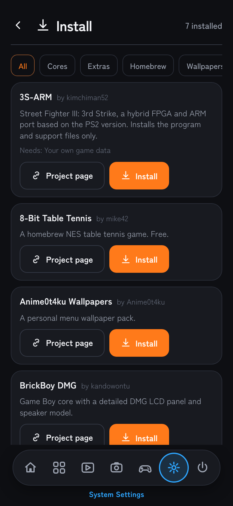

### TAS playback

On MC-NES the FPGA can play a tool-assisted speedrun on the TV. The app matches your ROM file by
checksum to the exact version on [TASVideos](https://tasvideos.org), lists the published runs for
it, downloads the one you pick to the card, and the core plays the inputs one per frame with the
timing held by the hardware. The Library marks every game that has a matching run. You can also add
your own `.fm2` files.

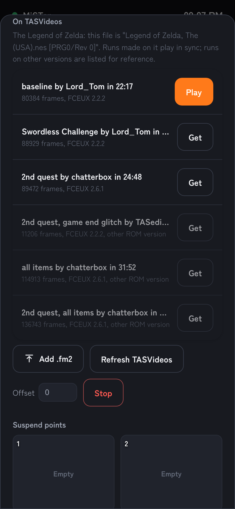

### More

- **Album**: every screenshot the MiSTer took and every clip the app captured, in one gallery,
  tagged by system.
- **Manuals**: the community manual catalogue (thousands of manuals across dozens of systems),
  downloaded per game only when you ask.
- **Saves**: list, download and upload SRAM saves, per core.
- **Install**: a catalogue of cores, homebrew, wallpaper packs and scripts, installed through the
  MiSTer's own downloader so update_all stays in charge of the files.
- **TV menu editor**: the folders and shortcuts on the TV menu, in the MiSTer's own order.
- **Quick settings**: hold the Home button for volume, mute, screenshot, the OSD, reset, and
  Bluetooth pairing, without leaving the game.
- **Music**, **wallpaper**, **backups**, **automation**, and a live broadcast to an RTMP URL.

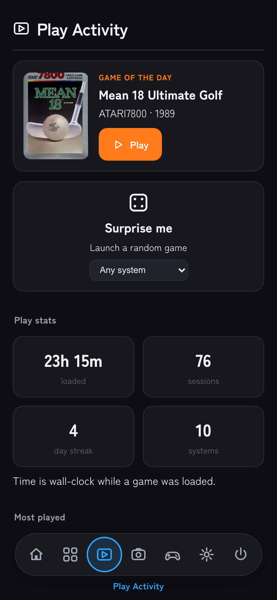 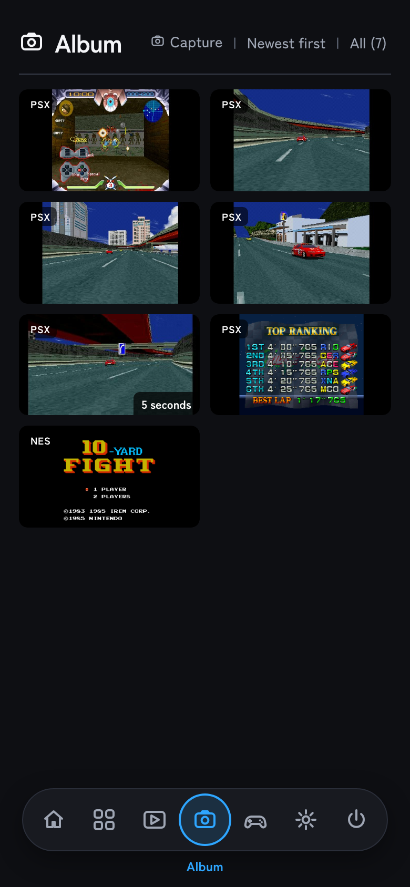 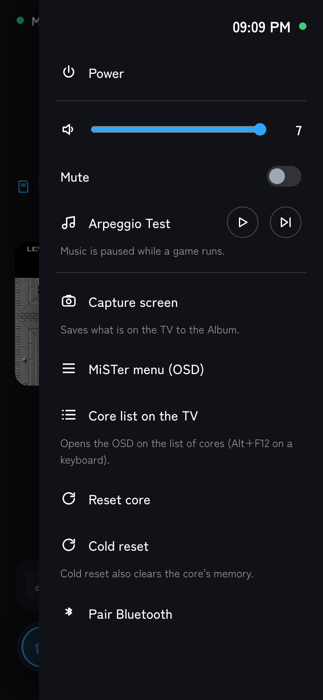

## Update

Any of these:

- In the app: **Settings > About > Install**. The app checks this repository once an hour.
- Run `mister-control` from the Scripts menu again.
- update_all: turn on "update_all" in Settings > About, or add this to `downloader.ini`:

```ini
[mister_control]
db_url = 'https://raw.githubusercontent.com/RemmyLee/mister-control-releases/main/db.json.zip'
```

## Files here

| File | What it is |
|---|---|
| Releases | `mister-control-<version>-armv7.zip`, `launchbox.db`, `ffmpeg-armhf` |
| `release.json` | the current version, URLs and SHA-256 checksums; read by the app and the installer |
| `db.json.zip` | the update_all downloader database |
| `cores/db.json.zip` | the downloader database for the MC cores (MC-NES) |
| `catalog.json` | the in-app Install catalogue |
| `files/` | the release's files one by one, for the downloader |
| `mister-control.sh` | the installer |

## Safety

The app listens on your LAN only and has no account or cloud side. Set a token as above if other
people share your network. Live broadcasting sends video only where you point it (an RTMP URL you
enter); the stream key stays on the MiSTer.

`ffmpeg-armhf` is the static build from https://johnvansickle.com/ffmpeg/ (GPL v3), unchanged.
